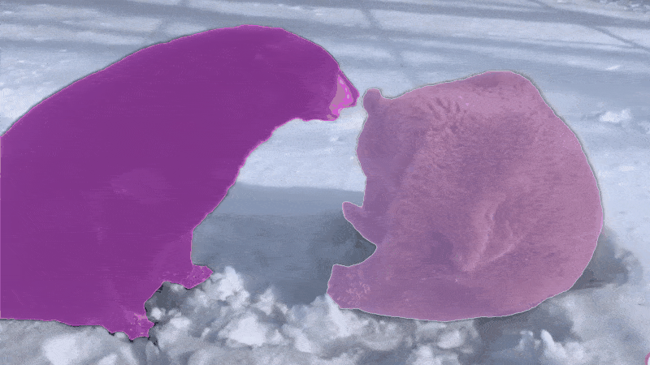
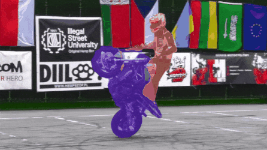

# MaskFreeVIS

Mask-Free Video Instance Segmentation [CVPR 2023].

This is the official pytorch implementation of [MaskFreeVIS](https://github.com/SysCV/MaskFreeVis/) built on the open-source detectron2. **We will finish the code organization/cleaning before the end of April. Stay tuned!**

Highlights
-----------------
- **High-performing** video instance segmentation **without using any** video masks or even image mask labels on all datasets. Using ResNet-50 and built on Mask2Former, MaskFreeVIS achieves 46.6 AP without using video masks, and 42.5 AP without any masks on YTVIS 2019.
- **Novelty:**: a new **parameter-free** Temporal KNN-patch Loss (TK-Loss), which leverages temporal masks consistency using unsupervised one-to-k patch correspondence.
- **Simple:** TK-Loss is flexible to intergrated with state-of-the-art transformer-based VIS models, with no trainable parameters.

Visualization results of MaskFreeVIS
-----------------

<table>
  <tr>
    <td></td>
    <td></td>
  </tr>
  <tr>
    <td></td>
    <td></td>
  </tr>
</table>

Introduction
-----------------
The recent advancement in Video Instance Segmentation (VIS) has largely been driven by the use of deeper and increasingly data-hungry transformer-based models. However, video masks are tedious and expensive to annotate, limiting the scale and diversity of existing VIS datasets. In this work, we aim to remove the mask-annotation requirement. We propose MaskFreeVIS, achieving highly competitive VIS performance, while only using bounding box annotations for the object state. We leverage the rich temporal mask consistency constraints in videos by introducing the Temporal KNN-patch Loss (TK-Loss), providing strong mask supervision without any labels. Our TK-Loss finds one-to-many matches across frames, through an efficient patch-matching step followed by a K-nearest neighbor selection. A consistency loss is then enforced on the found matches. Our mask-free objective is simple to implement, has no trainable parameters, is computationally efficient, yet outperforms baselines employing, e.g., state-of-the-art optical flow to enforce temporal mask consistency. We validate MaskFreeVIS on the YouTube-VIS 2019/2021, OVIS and BDD100K MOTS benchmarks. The results clearly demonstrate the efficacy of our method by drastically narrowing the gap between fully and weakly-supervised VIS performance.


Methods
-----------------


### Installation
Please see [Getting Started with Detectron2](https://github.com/facebookresearch/detectron2/blob/master/GETTING_STARTED.md) for full usage.

### Requirements
- Linux or macOS with Python 3.6
- PyTorch 1.9 and [torchvision](https://github.com/pytorch/vision/) that matches the PyTorch installation.
  Install them together at [pytorch.org](https://pytorch.org) to make sure of this. Note, please check
  PyTorch version matches that is required by Detectron2.
- Detectron2: follow [Detectron2 installation instructions](https://detectron2.readthedocs.io/tutorials/install.html).
- OpenCV is optional but needed by demo and visualization
- `pip install -r requirements.txt`

### CUDA kernel for MSDeformAttn
After preparing the required environment, run the following command to compile CUDA kernel for MSDeformAttn:

`CUDA_HOME` must be defined and points to the directory of the installed CUDA toolkit.

```bash
cd mask2former/modeling/pixel_decoder/ops
sh make.sh
```

#### Building on another system
To build on a system that does not have a GPU device but provide the drivers:
```bash
TORCH_CUDA_ARCH_LIST='8.0' FORCE_CUDA=1 python setup.py build install
```

### Example conda environment setup
```bash
conda create --name maskfreevis python=3.8 -y
conda activate maskfreevis
conda install pytorch==1.9.0 torchvision==0.10.0 cudatoolkit=11.1 -c pytorch -c nvidia
pip install -U opencv-python

# under your working directory
git clone git@github.com:facebookresearch/detectron2.git
cd detectron2
pip install -e .

cd ..
git clone https://github.com/SysCV/MaskFreeVIS.git
cd MaskFreeVIS
pip install -r requirements.txt
cd mask2former/modeling/pixel_decoder/ops
sh make.sh
```

Citation
---------------
If you find MaskFreeVIS useful in your research or refer to the provided baseline results, please star :star: this repository and consider citing :pencil::
```
@inproceedings{maskfreevis,
    author={Ke, Lei and Danelljan, Martin and Ding, Henghui and Tai, Yu-Wing and Tang, Chi-Keung and Yu, Fisher},
    title={Mask-Free Video Instance Segmentation},
    booktitle = {CVPR},
    year = {2023}
}  
